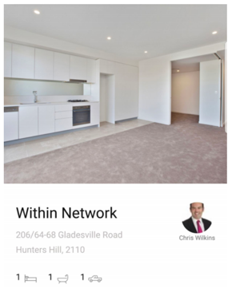

# Sentia Android Code Challenge

## Overview

To verify Android knowledge, we ask the developer to complete this small test.
This test will be evaluated on both the code quality, understanding of Android UX, design patterns
and architecture.
Estimation: 7 hours

## Specification

Create a new Android project that:

1. Parse json from the
   endpoint `https://f213b61d-6411-4018-a178-53863ed9f8ec.mock.pstmn.io/properties`
2. Displays the content in a list by following the design:

   
   
3. Displays the content in a detail screen: The detail screen can simply contain a Textview. When a
   list item is selected simply display the ID of the selected property.
4. Applying appropriate styling and design pleasantries, such as transitional animations or material
   styling is encouraged to exemplify your understanding of UX trends, best practices and
   conventions (e.g. at a minimum indeterminate progress indicators).

## Tips

1. Support orientation change. It should not redownload the data upon change.
2. Kotlin.
3. Android Architecture Components (MVVM) are encouraged.
4. Coroutine is encouraged, but you can also use Rx.
5. Dependency Injection is encouraged.
6. Test code is encouraged.
7. Performance matters.
8. Ensure the app is bug free and handles lifecycle callbacks.
9. Comment your code when necessary.
10. Submit code as a gradle project in a git repo.
11. Feel free to use common libraries with appropriate justification.
12. 12.Please include a README with a meaningful explanation.
